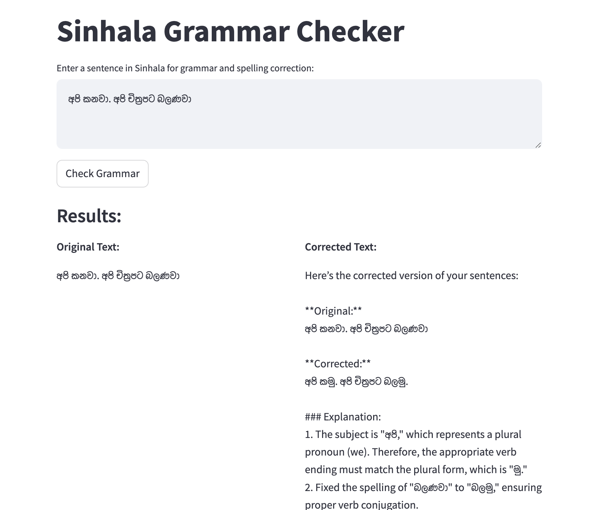

# Sinhala Spell and Grammar Checker (AI-Based)

This project implements a Sinhala spell and grammar checker powered by AI, designed to automatically detect and correct spelling and grammar mistakes in Sinhala text.

## Features

- **Spell Checking**: Automatically detects and corrects spelling errors in Sinhala words.
- **Grammar Checking**: Provides grammar suggestions for improved sentence structure and language correctness.
- **AI-Powered**: Utilizes machine learning techniques to improve accuracy and performance over time.

## Interface Screenshot

Below is an image of the interface for the Sinhala spell and grammar checker:



## Installation

Follow the steps below to run the project locally:

### Prerequisites

- Python 3.x
- Pip (Python package installer)

### Steps to Install

1. Clone the repository to your local machine:
   ```bash
   git clone https://github.com/chamarac99/sinhala-spell-grammer-checker-ai-based.git
